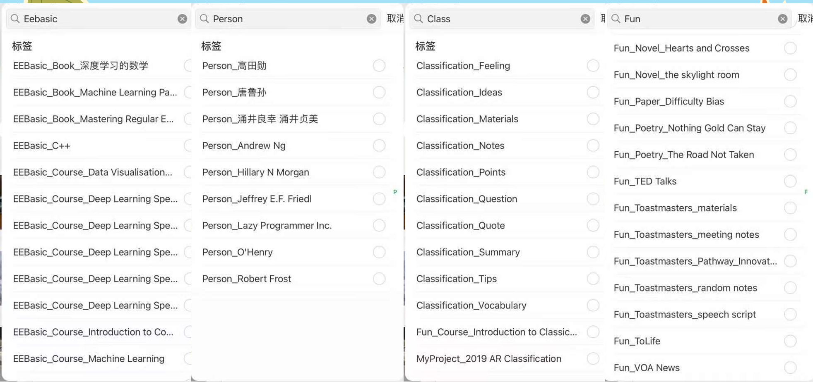

# 用 VS Code 打造个性化笔记系统
---
### 为什么选择 VS Code？Part 1
**Obsidian也可以实现的功能**
  * **本地化、安全：** 文件全部存储在本地，避免数据丢失truetrue
  * **免费、开放：** 无需付费，且公司一般不会限制安装。
  * **插件丰富：**
      * **高效编辑：** Vim
      * **多格式支持：** vscode-pdf
      * **笔记管理：** Foam
      * **时间记录:** Insert-date-string
      * **图片表示链接:** excalidraw :heart:
      * **kanban:** mark headboard
  * **兼容性强：** 即使文件格式不支持直接打开，VS Code 仍能显示文件。 
  * **Git：** 版本控制和同步。
---

### 为什么选择 VS Code？Part 2
**只有代码IDE能解决的问题**
  * **Jupyter:** 可以看Jupyter Notebook.
  * **一站式解决方案：** 结合 Python 或者你最熟悉的编程语言，快速实现更多极度定制化的功能, 免去自己写插件的时间和痛苦。
---
### Vscode哪里没有其他专门为笔记使用的软件好?
- 无法同步到手机, 只能在电脑上使用. 
  - 解决方案 同步使用Obsidian
    - 手机端Obsidian， reminder插件， 固定格式即可提醒时间
    - 通过icloud进行同步
- 无法搜索文本以外的内容, 相比之下印象笔记可以搜索手写的pdf文档
- 没有富文本编辑器.全靠语法渲染.没有个性字体.
- pdf support会差一些, 相比及之下obsidian可能可以直接修改pdf文档
- 不像其他笔记软件一样对笔记本身的支持那么强大丰富. 比如Obsidian开始有直接支持拖拽的插件.
---
### Markdown：基础且强大 Part 1
* **AI 辅助写作：** 利用 AI 生成 Markdown 初稿，提高效率。
---
### Markdown：基础且强大 Part 2
* **相关插件：**
    * **语法高亮、预览：** Markdown All in One/preview enhanced
    * **链接更新：** markdown link updater
    * **Emoji：** markdown emoji
    * **Mermaid：**  Markdown Preview Mermaid Support
    * **Footnote：** Markdown Footnotes
    * **better looking markdown table:**: Markdown Table Prettifier
---

### Markdown：基础且强大 Part 3
* **示例：**
  * **HTML：** 实现更复杂的布局和交互。
    * HTML 示例： [eg1][def] [eg2][def2]
  * **LaTeX：** 精准排版数学公式。
    * LaTeX 示例： [latex examples][def3]
  * **Mermaid：** 创建流程图、时序图等。
    * Mermaid 示例： [mermaid example][def4]
        * Mermaid Link: https://mermaid.js.org/
        * Mermaid 优点: 流程图, call flow, 全可以搞定
  * **Emoji：** 丰富笔记表达。
    * emoji 示例: :joy: :tent:
        * emoji link: https://dev.to/nikolab/complete-list-of-github-markdown-emoji-markup-5aia
  * **Footnotes：** 添加脚注，引用参考文献。
    * Footnote 示例:
        * 这是一个footnote [^1]
  * **Tag：** 方便笔记分类和检索。
    * 实现极其简单 只需要hash tag
    * 可以在foam中查看
  * **Metadata：** 方便笔记分类和检索。
    * 可以在foam中查看不同类型的笔记
    * 可以用于多维检索
  * **Code：** 可以插入各种代码 非常好看 可以高亮相应的语法
  ```c++
  #include <iostream>

  int main ()
  {
      cout<<"hellow World!"<<endl;
      return 0;
  }
---

### 进阶：Python 与 Jupyter Notebook
* **自动化与数据分析：** 使用 Python 处理数据、构建模型。
* **Jupyter Notebook：** 交互式编程环境，方便数据探索和可视化。
  * **示例：** [a link to my file][def5]
* **环境管理：** Anaconda 用于管理 Python 环境。
* **依赖管理：** 使用 `requirements.txt` 文件管理项目依赖。也方便同步到其他电脑设备.
* **all-in-one:**, 我的英语单词复习计划, 每日打卡, 学习计划管理, sqllite建立简单数据库. 周总结, 日总结. 可以完全按照自己的需求定制化
---
### Foam：强大的笔记管理工具
* **双向链接：** 建立笔记之间的关联。
* **笔记图谱：** 可视化笔记之间的关系。可以自定义不同类型的笔记所显示的颜色. 笔记的类型在Markdown metadata中定义.

!!! Ctrl +Shift + P :Show Graph
* **Placeholders:** 空link
* **Orphans:** 没有link到任何其他的地方的笔记
Another notes taking extension: Dendron
---
  
### Marp
Markdown to PPT, Amazing tool.

---

### 相关书籍推荐
1. <卡片笔记写作法>
     - 适用于写文章, 做project
       - 我自己的实践: 把知识库里的内容链接到Project的笔记中
       - logxpert
     - How to take smart notes? 中文译者很有心得.
     - 费曼说 

  !!!quote 直到做了科普演讲我才确定这个东西自己是真的懂了

1. <打造第二大脑>
     - 原则: CODE
     - 笔记组织形式: PARA 
     - https://www.buildingasecondbrain.com/
     - 十二个兴趣问题：诺贝尔奖得主的信息抓取法 - 依然是费曼
2. Nick Milo: Access, Ace(STIR) -> 先进的电脑双链时代产物.
   - https://www.youtube.com/watch?v=p0zWJ-TLghw&t=605s
   - 我自己的感受: Access太过注重细节, 但是大家需要自己的实践去确定自己的细节.
   - Ace的理论就好很多
   - https://forum.obsidian.md/t/the-ultimate-folder-system-a-quixotic-journey-to-ace/
3. Commonplace book
   1. https://www.masterclass.com/articles/how-to-keep-a-commonplace-book

4. Organize your tags
   1. https://frankbuck.org/evernote-tags/
   
     - 分类的创建成本高，检索成本低，所以分类只有数量少，重叠部分少，才能提高自顶向下查找的命中率。
      - 标签创建成本低，但是检索成本高，所以标签可以是跨类别的，标签越具体，组合越丰富，关键词命中率越高。

---
### 一点儿碎碎念

程序员的经验可以用到写笔记上. 
  - 笔记也一定要部署.Express 
  - 重要的东西才写到笔记里. Distill

我自己的文件夹建立:


我自己的重点:
1. 最核心的内容体积要小, 要精炼,便于查找便于同步.
2. 领域用树形结构确定.
3. 标签确定输出目标
4. 用类型定义项目的来源
5. 确定每个内容的复习计划,频率
6. 每一件事情都是因为不想做了或者没必要做了再不去做, 而不是因为忘掉了,所以不做了.
---

### 用Excel和markdown记录时间

我的两个Project
1. https://github.com/jovialchen/My-Personal-Management-System
2. https://github.com/jovialchen/task-management-python-markdown

---

[^0]: hahaha
[^1]: wowowowo

#出发吧专家家
#github_blog

[def]: html_example1.md
[def2]: html_example2.md
[def3]: equation.md
[def4]: mermaid.md
[def5]: my_example.ipynb