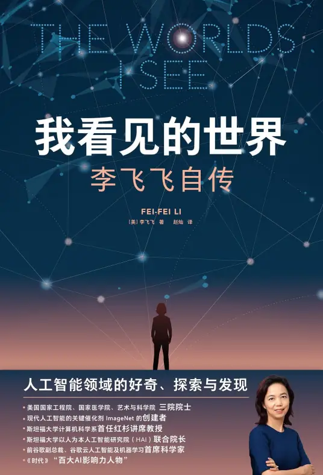
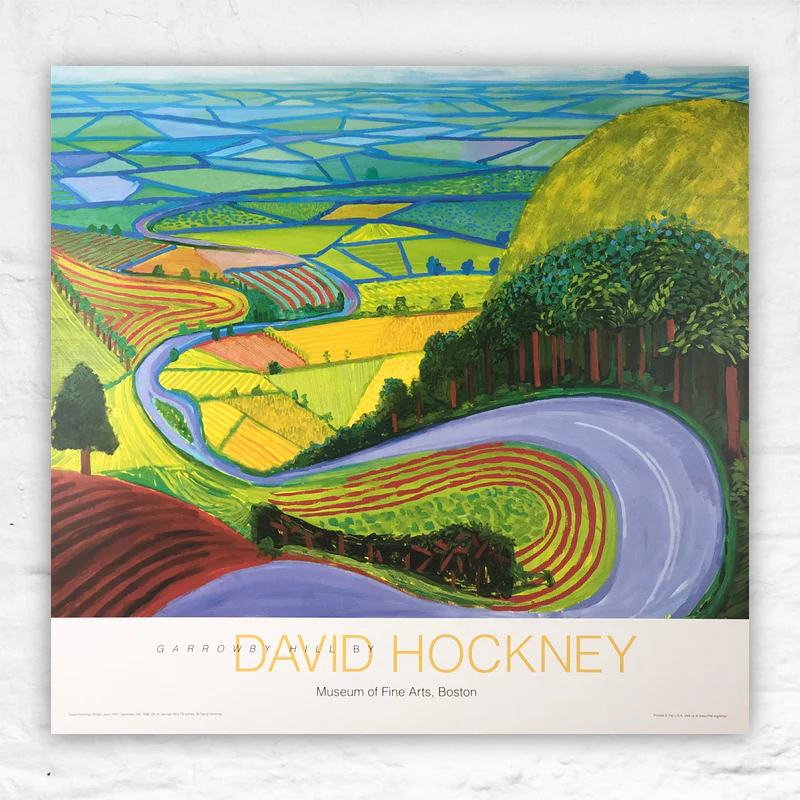

# 我看见的世界

作者：李飞飞

Host: Joyce
2024-10-10

---

## 故事脉络
- 华盛顿之行: AI以人为本, 母亲生病, 
- 成都： 飞飞这个名字, 外公外婆的杭州菜， 天真可爱聪明却不靠谱的父亲，叛逆又热爱文学的母亲，性别观念先进的家庭, 性别偏见的老师, 对物理学的热爱以及文学启蒙, 奇怪的1989年
- 上海： 爱因斯坦下榻过的饭店 - 浦江饭店
- 新泽西：接机迟到的父亲，移民社区狭小的居住空间，拮据的生活，课余打工-广东餐厅， 艰难的英语课，ESL小伙伴被打, 普林斯顿大学周末行， 和撒贝拉先生聊文学， 令人惊喜的提前录取，选择物理学专业，大学生活，家里的干洗店, 
- 加州: 伯克利的暑期实习, 加州理工, 博士导师：彼得罗·佩罗那，克里斯托弗·科赫, Caltech 101+one shot learning, 吉滕德拉(导师的导师), 西尔维奥,
- 教职生涯ImageNet: 普林同事: 李凯, 学生：ImageNet 邓嘉: 解决问题: wordnet,雇佣本科生, 计算机工具但希望更多事人类输入, 来自吉滕德拉的否定, 众包, 搬到斯坦福, 完成ImageNet, 开会准备ImageNet的笔, ImageNet无人问津, 准备ImageNet的比赛, AlexNet和ImageNet彼此成就.
---

## 故事脉络 Cont'd
- 后ImageNet时代: AlexNet开启了新时代, 乌克兰女生奥尔加开始组织比赛, 深入类别分支, 蒂姆特尼建议与人口调查局的数据合作,谷歌街景汽车项目, 安德烈·卡尔帕希->从图片理解信息(多模态)-来自谷歌的挑战, 人工智能沙龙, 和重病的母亲聊人工智能阿尼·米尔斯坦, alphago赢了, 安德烈拒了普林的offer加入OpenAI, 人工智能不再是学术研究, 需要工业界的资金支持, 加入谷歌, 母亲手术, 父亲小的时候养了一只熊, 华盛顿学术听证会, 回到讲台教书育人, 继续AI以人为本.
---

### Prof Feifei的英雄旅程
克里斯多夫·佛格勒指出了英雄旅程中的十二阶段[def1^]
- 伊利亚特, 奥德赛, 指环王, 亚瑟王, 哈利波特
1. 平凡世界 ——故事以平凡世界开始，可做为比较基准，凸显非常世界的特别之处。平凡世界也代表英雄的背景和出身。最佳的构思是将平凡世界与非常世界塑造成南辕北辙，使英雄旅程更加戏剧化。平凡世界的作用也包括困境的伏笔、向英雄抛出问题、向观众介绍英雄出场、营造认同感；并展示英雄的悲剧性缺陷、伤痛、解说背景故事和主题。
   1. 成都
2. 冒险的召唤 ——要求英雄上路的各种形式，代表抉择过程。许多故事中，冒险的召唤可能不只一个。
   1. 爸妈的选择, 来自普林的offer, 对专业选择-> 物理or赚钱?
3. 拒绝召唤 ——凸显旅程的危险和代价。英雄拒绝召唤最常见的方式就是“找借口”，然后都会被迫上路。
   1. 贯穿始终, 家里的经济压力, 母亲的病痛, 各种来钱快的专业和高薪职位的诱惑
4. 遇上师父 ——提供英雄上路所需的任何东西。师傅也可以是反派角色，误导英雄走上绝路或背叛英雄。
   1. 撒贝拉先生
5. 跨越第一道门槛 ——第一幕的结尾，英雄来到两个世界的边界，开始上路，故事真正开始。
   1. 普林斯顿
6. 试炼、盟友、敌人 ——进入非常世界，英雄开始迎接试炼、结交盟友或树立敌人，三者顺序不拘。敌人也经常以竞争对手取代。
   1. caltech 101

---

### Prof Feifei的英雄旅程 Cont'd
7. 进逼洞穴最深处 —— 即将抵达非常世界的核心，通常更加神秘。
   1. ImageNet
2. 苦难折磨: 故事核心，最真实的恐惧。与敌人对抗，英雄一定会在这里有各种形式的死亡象征，或受到死亡影响，才能重生。
   1. 无人问津的ImageNet
3.  奖赏（掌握宝剑): 死里逃生的英雄获得报酬，换得在非常世界中追寻的某种东西。
    1.  与AlexNet相互成就, 人工智能开启新时代
4.  归返之路 ——第三幕的开头，可能会是故事的转折点，英雄将继续上路或回到平凡世界，也是另一道门槛。在许多案例中，这里会是追逐场面、报复性行动或更强大的阻碍。 
    1.  来自谷歌的竞争: 对工业界的新认识
    2.  和母亲的聊天: 以人为本: 开始于阿尼·米尔斯坦合作
5.  复苏 —— 故事高潮，最后一次面对死亡或威胁，英雄与敌人的最后对决、牺牲、转变或做出最困难的抉择。
    1.  华盛顿: 人工智能听证会
    2.  母亲面临严重手术, 撒贝拉先生离世
6.  带着万灵丹归返 ——故事结局，英雄从非常世界回到平凡世界，而且带着战利品。封闭式结局会让故事回到起点，开放式结局则让情节继续。
    1.  继续追求AI以人为本, 用自己学识为社会做贡献
---

## J's Feeling

表面上看: 是一本自传 
实际上: 情节跌宕起伏, 主人公的成长线完整, 人物性格鲜明, 同时也是一部人工智能的科普书籍.
### 印象深刻: 
- 每次在理想和现实利益之间摇摆, 父母都会问: 这是你想要的吗?
  - 不计代价成全孩子的中国父母
  - 和鲍勃的聊天: 意识到对父母的要求理所当然
- 多才多艺的科学家们
  - 彼得罗把午饭变成David Hockney的拼贴画, 第一次见面就问蒙德里安
  - 克里斯托弗: 给色盲解释红色, 第一性原理
  - 科学家去涉足心理学, 文字学才能领域的问题: wordnet->imagenet分类
  - Feifei喜欢表达能力强社交能力强的学生: 奥尔加, AlexNet的演讲者
- 对科学的热爱和对理想的坚持

 

---

## Discussion During The Meeting
T:
传说中,一开始就是人工智能的科普书.
父母的勇气.

C:
最感动, 飞飞的爸爸, 特别孩子气. 感觉自己没有意义的事情很少去做.
飞飞对物理的热爱. 感觉自己潜意识里想要上价值.
母亲的反抗精神也很难得.

A:
飞飞的父母没有功利化的想法.
去美国的路上, 妈妈的手在抖.
要保持一个世界观的眼界.
坚信自己的追求是因为自己的眼界.

V:
反抗的意志.
妈妈的上层建筑来自于她的父辈.

[def1^]: https://zh.wikipedia.org/wiki/%E8%8B%B1%E9%9B%84%E6%97%85%E7%A8%8B