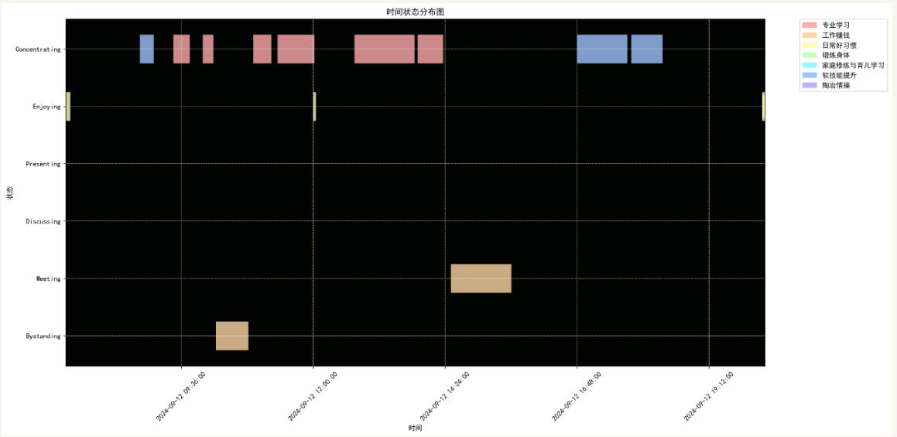

# task-management-python-markdown
My own task management, time record and finance record python code.

# Using Vscode + Python to manage my tasks
So my task management can be in the same folder of my notes.

## Create Task
1. **Create Task Folder:**
   - Navigate to the `Tasks` folder.
   - Create a new subfolder within any category folder under `Tasks` using the name of the task. This folder will represent the specific task you're creating.

2. **Run Script:**
 - In your terminal, activate the appropriate virtual environment (e.g., `conda activate joyce_notes`).
- Run the script located at `Logs/Time/src/create_task.py` using the command:
```bash
python Logs/Time/src/create_task.py
```

3. **Edit Task Details:**
- Open the newly created file named `task.md` (which is the file generated by the script) within your newly created task folder.
- Edit the information in the `task.md` file to accurately reflect the details of your task. This might include:
     - Task description
     - Due date (optional)
     - Priority (optional) - when applicable, task will appear on kanban
     - Other relevant information specific to your task

4. **Subtasks (Optional):**
   - If your task involves subtasks, you can add new folders under that task. and then repeat step 2 and 3 to generate and update task.md for that subtask.
   - **Important Note:**  **If you've classified this task as "inattentive," refrain from adding subtasks,** as this type of task might not benefit from them.

**Notes:**
- special rules when create new `task.md`
```python
special_rules = {
    "Birthday": {"Frequency": "Yearly", "Content Type": "Errand", "Priority":"Inattentive"},
    "Errands": {"Content Type": "Errand", "Priority":"Inattentive"},
    "Excercise": {"Content Type": "Practice", "Frequency":"Daily", "Priority":"Everyday" },
    "GoodHabits": {"Content Type": "Practice", "Frequency":"Daily", "Priority":"Everyday"}
}
```
## Generate Kanban Board for Tasks
By following these steps, you can generate a Kanban board that reflects your prioritized tasks, excluding daily check categories.

1. **Run Script:**
- In your terminal, activate the appropriate virtual environment (e.g., `conda activate joyce_notes`).
- Run the script located at `Logs/Time/src/generate_kanban.py` using the command:
```bash
python Logs/Time/src/generate_kanban.py
```
2. **View Kanban Board:**
   - Open your Kanban board file located at `Logs/kanban.md`.

**Notes:**

- Tasks with a defined priority will be included in the Kanban board.
- Tasks in categories like "Excercise" (Exercise) and "GoodHabits" (Daily Habits) are considered daily checks and are **excluded** from the Kanban board.


## Generate Today's Plan

This script generates a plan for your tasks specifically for the chosen date.

1. **Run Script:**
   - Replace `2024-08-15` with the desired date in the following command:

     ```bash
     python Logs/Time/src/generate_today_plan.py 2024-09-13
     python Logs/Time/src/generate_today_checklist.py 2024-09-13
     ```

     **Important:** Ensure you replace `**YOUR_DATE**` with the actual date in YYYY-MM-DD format (e.g., 2024-08-16 for tomorrow).

   - Run the script with the updated command. This will generate or update your plan for the specified date.
2. **View your plan**
    - under the folder of `/Logs/Year/Year-Month/`, e.g. 2024-08-15, 2024-08-15.md will be created under `/Logs/2024/202408`.


## Generate Today's Report

This script generates a report for today's (**2024-08-15**) time usage and inserts data into the database.
1. **Run Script:**
```bash
python Logs/Time/src/generate_checklist_table.py 2024-09-13
```
Then copy to that day's md file.
```bash
python Logs/Time/src/generate_today_report.py 2024-09-13
```
It will give you a report of how your day is spent.


2. **This file performs the following features.**
   1. **Time Usage Plot:**
       - Generate a plot visualizing how time was spent today. 
       - You can leverage libraries like Matplotlib or Seaborn for creating the plot.
   2. **Database Insertion:**
       - Insert data about today's time usage into the database.
       - Ensure the script connects to the appropriate database and uses the correct schema for data insertion.
   3. **Inattentive Tasks:**
        - If the task is done, we will insert it into the database.

## Generate Weekly/Monthly/Yearly Report

This script calculates how much time you spent in each category for a specified period. 

### Supported Reports:
* Weekly Report: Summarizes the previous week's data.
* Monthly Report: Summarizes the entire month's data.
* Yearly Report: Summarizes the entire year's data.

### Running the Script:
1. **Replace `**YOUR_DATE**` with the desired date:** 
  * For a weekly report, use a date within the target week (e.g., `2024-08-15` for the week ending before Aug 15th).
  * For a monthly report, use the year and month (e.g., `2024-08` for August 2024).
  * For a yearly report, use the year (e.g., `2024` for the year 2024).
2. **Run the script with the updated command:**
  * Weekly report:
    ```bash
    python Logs/Time/src/generate_weekly_report.py 2024-08-19
    ```
  * Monthly report:
    ```bash
    python Logs/Time/src/generate_monthly_report.py 2024-08
    ```
  * Yearly report:
    ```bash
    python Logs/Time/src/generate_yearly_report.py 2024 ```

* `<Report_Type>` is "weekly", "monthly", or "yearly".
* `<Year>` is the year of the report.
* `<Year_Month>` is the year and month combined (only used for monthly reports).

### Example:
* Running `python Logs/Time/src/generate_weekly_report.py 2024-08-18` (assuming data exists for the week) will generate a report for the week ending Aug 18th, 2024. 
* The report will be saved as `/Logs/Reports/weekly/2024/202408.md`.


## Maintain a List of Non-Project Items
This file helps you keep track of recurring tasks that aren't directly tied to specific projects. These tasks are essential but don't contribute to a particular project's outcome.

**Example Tasks:**
* Daily meetings
* Habits but just occasionaly happen
* Exercise but not routines

Please see the link here:
## Update Due Dates for Inattentive Tasks

This script automates updating due dates for tasks marked as "Inattentive" with recurring schedules (weekly, monthly, yearly).

**Target Tasks:**

* Tasks with the label "Inattentive."
* Tasks with recurring due dates (weekly, monthly, or yearly).

**Functionality:**

1. **Identify Tasks:**
   * The script scans for the latest 20 tasks marked as "Inattentive" within your task management system (specific implementation details not provided).
2. **Update Due Dates:**
   * If a task has a recurring due date (weekly, monthly, or yearly), the script:
      * Checks if the task is marked as "Done."
      * If done, the script calculates the next due date based on the original recurrence (e.g., next week for weekly tasks).
      * The updated due date is applied to the task.
3. **Frequency:**
   * Run the script regularly to ensure timely updates for inattentive recurring tasks.

**Running the Script:**

1. **Command:**
```bash
python Logs/Time/src/update_due_date.py
```
## After Project Completion
**Action:**
* Copy the entire project folder to an archive location in your notes.
* Alternatively, delete the project folder completely.

## Future work:
- Generate project info